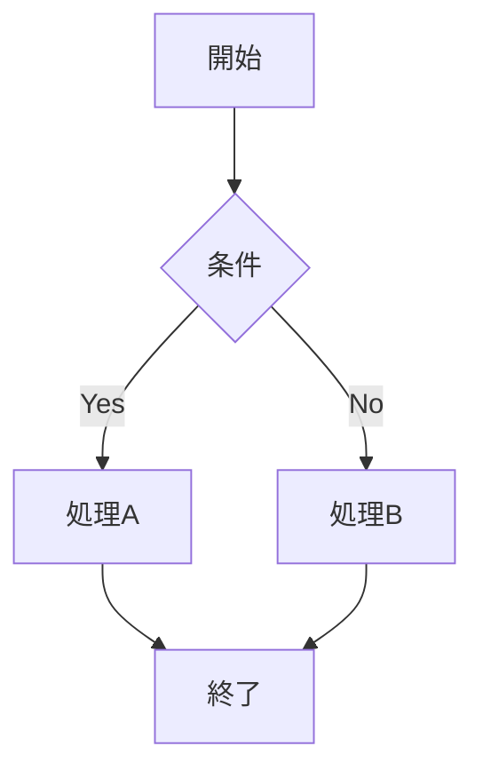

# Document Design Suite - ドキュメント・可視化統合スキル

## 概要

プレゼンテーション、表、データ可視化を包括的に作成するための統合スキルです。学術的厳密性とビジュアルインパクトを両立させます。

**統合元スキル**：
- presentation-visual-design（プレゼンビジュアル）
- table-craftsman（表作成）
- csv-data-summarizer（データ分析・可視化）

## When to Use This Skill

以下の場合にこのスキルを使用：

- プレゼンテーションスライド・図表作成
- 学術論文用の表（APA/Chicago形式）
- ビジネス文書・レポートの表
- CSVデータの分析・可視化
- インフォグラフィック・ダイアグラム作成

**トリガーキーワード**：
- 「スライド作成」「プレゼン資料」「Key Visual」
- 「表作成」「テーブル」「APA形式の表」
- 「データ可視化」「チャート作成」「グラフ」
- 「CSV分析」「データサマリー」

---

# Part 1: プレゼンテーションビジュアル

## 1.1 15種類のビジュアライゼーション

| タイプ | 用途 | 最適ケース |
|--------|------|------------|
| Listing | 要点の迅速提示 | 特徴、戦略、コンポーネント一覧 |
| Comparison | 2項目以上の対比 | 競合分析、Before/After |
| Categorization | 属性別グルーピング | 市場セグメント、分類 |
| Hierarchy | 上下構造の表示 | 組織図、決定木 |
| Matrix/Quadrant | 2軸での位置づけ | リスク評価、戦略マップ |
| Sequence/Process | ステップ進行 | ワークフロー、顧客ジャーニー |
| Circular Flow | 循環プロセス | PDCAサイクル、フィードバックループ |
| Timeline | 時系列展開 | プロジェクト計画、ロードマップ |
| Venn Diagram | 重複関係 | 共通特性、市場オーバーラップ |
| Cause & Effect | 因果分析 | 問題分析、影響評価 |
| Problem & Solution | 課題と解決策 | ビジネスケース、提案 |
| Components/Pillars | 構成要素 | 戦略フレームワーク、成功要因 |
| Funnel | 絞り込みプロセス | セールスファネル、選考プロセス |
| Nested/Concentric | 包含関係 | エコシステム、レイヤー構造 |
| Charts | 定量データ可視化 | 業績指標、トレンド、分布 |

## 1.2 3層情報設計

```
タイトルゾーン (上部100px)
├── スライドタイトル（h1）
├── 920px幅、左右20pxパディング

コンテンツゾーン (380px, y=110-490)
├── 主要コンテンツ
├── 左右20-40pxマージン
├── 要素は水平整列

フットノートゾーン (下部40px, y=500-540)
├── 10ptフォント
├── 出典、注釈のみ
```

## 1.3 実装方法

### 方法A: html2pptx（推奨）
```
- 高度なカスタマイズ可能
- プログラマティックな制御
- HTMLからPowerPointへ変換
```

### 方法B: Mermaid図


### 方法C: ASCII図
```
┌─────────────┐
│   タイトル   │
├─────────────┤
│  コンテンツ  │
│             │
└─────────────┘
```

## 1.4 デザイン原則

```
Bold Aesthetic Direction（大胆な美的選択）
- 各プレゼンで少なくとも1つの大胆なデザイン選択

コントラスト
- テキストと背景：4.5:1以上
- 重要要素の視覚的強調

整列
- グリッドベースのレイアウト
- 要素間の一貫した間隔

繰り返し
- 色、フォント、スタイルの一貫性
- ブランドガイドラインの遵守
```

---

# Part 2: 表作成（Table Craftsman）

## 2.1 対応フォーマット

| カテゴリ | 用途 | 特徴 |
|---------|------|------|
| プレゼンテーション | 16:9スライド用 | 大フォント、高コントラスト |
| 学術論文 | APA/Chicago形式 | 罫線最小化、注釈対応 |
| ビジネス文書 | レポート・提案書 | プロフェッショナル |
| 一般文書 | ドキュメント・Web | 柔軟性重視 |

## 2.2 出力形式

- **HTML/CSS**: インタラクティブ、Web埋め込み
- **PDF**: 印刷・配布用
- **PNG**: 画像埋め込み、プレゼン用
- **Markdown**: テキストベース

## 2.3 学術論文用（APA形式）

### 3本線ルール
```
━━━━━━━━━━━━━━━━  （タイトル下）
  ヘッダー行
━━━━━━━━━━━━━━━━  （ヘッダー下）
  データ行...
━━━━━━━━━━━━━━━━  （表の最下部）
```

### APA形式の必須要素
```
- 表番号（Table 1, Table 2...）
- 表タイトル（イタリック）
- 列ヘッダー（中央揃え）
- 注釈（一般注、特定注、確率注）
```

### 例
```
Table 1
Descriptive Statistics for Study Variables

━━━━━━━━━━━━━━━━━━━━━━━━━━━━━━━━━━━━
Variable        N       M       SD
━━━━━━━━━━━━━━━━━━━━━━━━━━━━━━━━━━━━
Age             120     34.5    8.2
Experience      120     5.3     3.1
Performance     118     4.2     0.9
━━━━━━━━━━━━━━━━━━━━━━━━━━━━━━━━━━━━

Note. N = sample size, M = mean, SD = standard deviation.
*p < .05. **p < .01.
```

## 2.4 プレゼンテーション用

### スタイルガイドライン
```
サイズ: 1920x1080px または 1280x720px
フォントサイズ: ヘッダー 24-32pt / ボディ 18-24pt
行の高さ: 最小 48px
配色: 高コントラスト（明度差 4.5:1 以上）
罫線: 太めの線（2-3px）または無し
セル余白: 16-24px
```

### 設計原則
```
- 遠くからでも読める
- 情報は最小限（1スライド1メッセージ）
- 数値は右揃え、テキストは左揃え
- 重要セルはハイライト
```

## 2.5 色彩パレット

### Academic（学術）
```css
--header-bg: #f8f9fa;
--header-text: #212529;
--border: #dee2e6;
--row-alt: #ffffff;
--row-alt2: #f8f9fa;
```

### Business Blue
```css
--header-bg: #0d6efd;
--header-text: #ffffff;
--border: #dee2e6;
--row-alt: #ffffff;
--row-alt2: #e7f1ff;
```

### Presentation Dark
```css
--header-bg: #212529;
--header-text: #ffffff;
--border: #495057;
--row-alt: #343a40;
--body-text: #f8f9fa;
```

---

# Part 3: CSVデータ分析・可視化

## 3.1 概要

CSVファイルを自動分析し、包括的なサマリーと可視化を提供。

## 3.2 自動分析ステップ

```
⚠️ 重要：ユーザーに「何をしますか？」と聞かない
即座に完全な分析を実行する

1. CSVファイルをpandas DataFrameに読み込み
2. データ構造を特定（列タイプ、日付列、数値列、カテゴリ）
3. データタイプに基づいて関連分析を決定
4. 意味のある可視化のみを作成
5. 包括的な出力を自動生成
```

## 3.3 データタイプ別適応

| データタイプ | 特徴 | 分析内容 |
|--------------|------|----------|
| 売上/EC | 注文日、売上、商品 | 時系列トレンド、商品パフォーマンス |
| 顧客 | デモグラフィック、地域 | 分布分析、セグメンテーション |
| 財務 | 取引、金額、日付 | トレンド分析、統計サマリー |
| 業務 | タイムスタンプ、指標、ステータス | 時系列、パフォーマンス指標 |
| アンケート | カテゴリ回答、評価 | 頻度分析、クロス集計 |

## 3.4 自動生成可視化

```
条件付き生成：
- 時系列プロット: 日付/タイムスタンプ列がある場合のみ
- 相関ヒートマップ: 複数の数値列がある場合のみ
- カテゴリ分布: カテゴリ列がある場合のみ
- ヒストグラム: 数値列の分布（関連する場合）
```

## 3.5 出力形式

```
**データセット概要**
- 5,000行 × 8列
- 数値列3つ、日付列1つ

**サマリー統計**
- 平均注文額: ¥5,820
- 標準偏差: ¥1,240
- 欠損値: 2% (100セル)

**インサイト**
- 売上は時間とともに上昇傾向
- Q4にピーク活動
- [添付: トレンドプロット]
```

## 3.6 Pythonコード例

```python
import pandas as pd
import matplotlib.pyplot as plt
import seaborn as sns

def analyze_csv(file_path):
    """CSVファイルの包括的分析"""

    # データ読み込み
    df = pd.read_csv(file_path)

    # 基本情報
    print(f"行数: {len(df)}")
    print(f"列数: {len(df.columns)}")
    print(f"\n列タイプ:\n{df.dtypes}")

    # 数値列の統計
    numeric_cols = df.select_dtypes(include=['number']).columns
    if len(numeric_cols) > 0:
        print(f"\n数値統計:\n{df[numeric_cols].describe()}")

    # 欠損値
    missing = df.isnull().sum()
    if missing.any():
        print(f"\n欠損値:\n{missing[missing > 0]}")

    # 相関行列（数値列が複数ある場合）
    if len(numeric_cols) > 1:
        plt.figure(figsize=(10, 8))
        sns.heatmap(df[numeric_cols].corr(), annot=True, cmap='coolwarm')
        plt.title('相関行列')
        plt.tight_layout()
        plt.savefig('correlation_matrix.png')

    # カテゴリ列の分布
    cat_cols = df.select_dtypes(include=['object', 'category']).columns
    for col in cat_cols[:5]:  # 最初の5列
        if df[col].nunique() <= 20:
            plt.figure(figsize=(10, 6))
            df[col].value_counts().plot(kind='bar')
            plt.title(f'{col}の分布')
            plt.tight_layout()
            plt.savefig(f'{col}_distribution.png')

    return df
```

---

# Part 4: 品質チェックリスト

## ビジュアル品質
```
[ ] テキスト切れ・重複なし
[ ] 適切なコントラスト比（4.5:1以上）
[ ] 要素の整列
[ ] 視覚的階層の明確さ
[ ] フォントサイズの適切性
```

## 学術基準
```
[ ] データは報告書から直接引用
[ ] 適切な引用形式
[ ] 用語の一貫性
[ ] 図表番号と出典明記
[ ] APA/Chicago形式準拠
```

## データ品質
```
[ ] 欠損値の表示は適切か
[ ] 小数点以下の桁数は統一
[ ] 単位は明記
[ ] 注釈は必要な箇所に
```

## アクセシビリティ
```
[ ] スクリーンリーダーで読み取れるか
[ ] 色だけに依存していないか
[ ] 表のキャプションは適切か
```

---

# Part 5: 起動コマンド

## プレゼンテーション作成
```
Document Design Suite起動

目的: プレゼンテーション
ビジュアルタイプ: [Matrix/Flow/Timeline/etc.]
コンテンツ: [図解したい内容]
スタイル: [アカデミック/ビジネス/ダーク]
出力: [HTML/PNG/PowerPoint]
```

## 表作成
```
Document Design Suite起動

目的: 表作成
フォーマット: [APA/Chicago/ビジネス/プレゼン]
データ: [データ内容または CSV パス]
出力: [HTML/PDF/PNG/Markdown]
```

## CSV分析
```
Document Design Suite起動

目的: CSV分析
ファイル: [CSVファイルパス]
分析タイプ: [フル/統計のみ/可視化のみ]
出力: [レポート/チャート]
```

---

## 連携スキル

| スキル名 | 役割 |
|----------|------|
| academic-research-suite | 文献レビュー・論文執筆・引用管理 |
| research-data-hub | 分析データの取得・品質管理 |
| strategic-research-platform | 研究デザイン・統計分析結果の出力 |
| thinking-toolkit | 理論構築・批判的分析 |
| code-quality-guardian | コード品質・再現性保証 |

---

**バージョン**: 1.0.0
**統合日**: 2025-11-28
**統合元**: presentation-visual-design, table-craftsman, csv-data-summarizer
